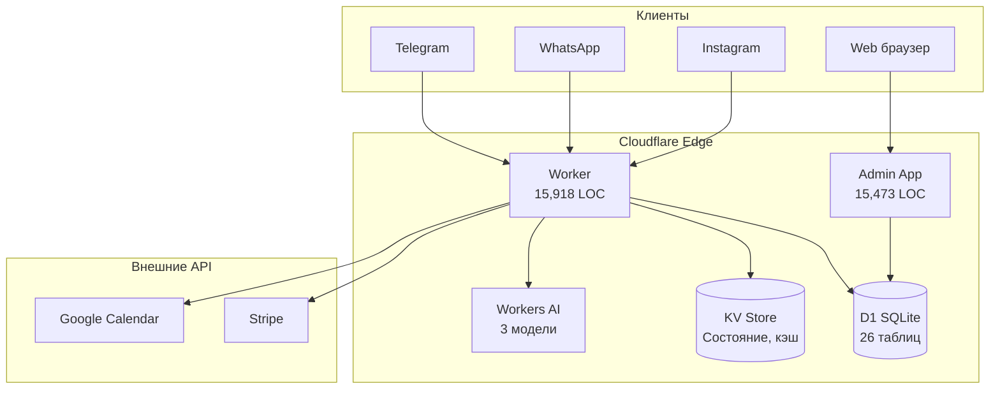
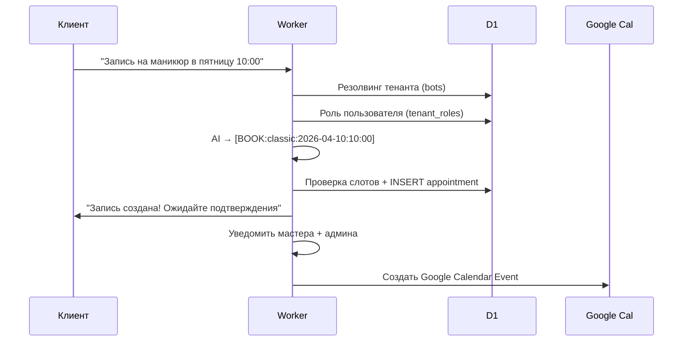

# ManicBot — Технический аудит платформы

> **Дата:** 4 апреля 2026
> **Версия:** 1.0
> **Аудитор:** Claude Code (Opus 4.6)
> **Scope:** Полный аудит кодовой базы, архитектуры, безопасности и производительности

---

## 1. Executive Summary

**ManicBot** — multi-tenant SaaS-платформа для автоматизации бронирования в салонах красоты. Платформа обслуживает клиентов через три канала (Telegram, WhatsApp, Instagram) с единым бэкендом на Cloudflare Workers и админ-панелью на Next.js.

### Ключевые метрики

| Метрика | Значение |
|---------|----------|
| Общий объём кода | 31,391 LOC |
| Worker (JS) | 126 файлов / 15,918 LOC |
| Admin Mini-App (TS/TSX) | 108 файлов / 15,473 LOC |
| Тестов | 58 файлов (~900 тестов) |
| Таблиц D1 | 26 |
| Миграций | 8 |
| Внешних интеграций | 6 |
| Языков интерфейса | 4 (RU, UA, EN, PL) |

### Оценка зрелости

| Область | Оценка | Комментарий |
|---------|--------|-------------|
| Архитектура | 8/10 | Чистое разделение ответственности, грамотный multi-tenant |
| Безопасность | 7/10 | HMAC, шифрование, PBKDF2, но есть race condition и отсутствие rate limiting |
| Качество кода | 7/10 | Хорошая структура, но крупные монолитные обработчики |
| Тестирование | 7/10 | Отличное покрытие Worker, но почти нет тестов в admin-app |
| Производительность | 8/10 | Минимальные зависимости, edge computing, но нужен backoff для Google |
| DevOps/CI | 8/10 | Автоматический деплой с гейтами, schema sync check |
| Документация | 9/10 | Отличная: CLAUDE.md, README, setup guides для каждой интеграции |

### Критические находки

| ID | Severity | Проблема |
|----|----------|----------|
| S1 | CRITICAL | Race condition при одновременном бронировании |
| S2 | HIGH | Нет rate limiting на auth endpoints admin-app |
| S3 | HIGH | AI prompt injection — пользовательский текст не санитизирован |
| S4 | HIGH | BOT_ENCRYPTION_KEY опционален — plaintext токены в D1 |
| S5 | HIGH | Google Calendar sync без backoff — риск DOS |

---

## 2. Анализ архитектуры

### 2.1 Обзор системы

Платформа состоит из двух деплоимых юнитов:

| Юнит | Технология | Деплой | Назначение |
|------|------------|--------|------------|
| Worker | Cloudflare Workers (JS) | `wrangler deploy` | Обработка вебхуков, бизнес-логика, cron |
| Admin Mini-App | Next.js 15 + tRPC 11 | GitHub Actions → Pages | Панель управления салоном |

Дополнительно:
- **Landing** (`manicbot-analysis/`): React 19 + Vite, публичный сайт
- **Blog** (`manicbot-blog/`): Статический генератор, интегрирован в landing

### 2.2 Диаграмма архитектуры



> Полная версия диаграммы: [`visualization/01-system-architecture.svg`](visualization/01-system-architecture.svg)

### 2.3 Multi-tenancy

Архитектура multi-tenant реализована грамотно:

- **D1** — основное хранилище, все таблицы имеют `tenant_id`
- **KV** — fallback для legacy-режима, префикс `t:{tenantId}:`
- **Резолвинг тенанта:**
  - Telegram: `/webhook/{botId}` → D1 `bots` → `tenant_id`
  - WhatsApp: `phone_number_id` → D1 `channel_configs` → `tenant_id`
  - Instagram: `entry.id` → D1 `channel_configs` → `page_id/ig_account_id`

**Контекст:** `buildTenantCtx()` создаёт объект с `tenantId`, `bot`, `db`, `kv`, `channel` — все хендлеры работают с изолированным контекстом.

### 2.4 Data Flow: бронирование



> Полная версия: [`visualization/02-data-flow.svg`](visualization/02-data-flow.svg)

### 2.5 Ролевая модель (RBAC)

| Роль | Scope | Доступ |
|------|-------|--------|
| `system_admin` | Платформа | God Mode — полный доступ ко всему |
| `technical_support` | Платформа | Тех. поддержка, суперсет `support` |
| `support` | Платформа | Клиентская поддержка, тикеты |
| `tenant_owner` | Тенант | Управление салоном, мастерами, услугами |
| `master` | Тенант | Своё расписание, клиенты, заработок |
| `client` | — | Бронирование через бот (без панели) |

Резолвинг ролей: `ADMIN_CHAT_ID` (env) → `platform_roles` (D1) → `tenant_roles` (D1) → `client` (default).

> Полная диаграмма: [`visualization/03-auth-flow.svg`](visualization/03-auth-flow.svg)

---

## 3. Обзор качества кода

### 3.1 Структура Worker

```
src/
├── handlers/     # message.js (1352 LOC), callback.js (1378 LOC), inbound.js, cron.js
├── http/         # Маршрутизация: 10 модулей
├── services/     # Бизнес-логика: appointments, users, calendar, chat, state
├── channels/     # Multi-channel: telegram, whatsapp, instagram, graph-api
├── billing/      # Stripe: config, webhooks, features, lifecycle, storage
├── tenant/       # Multi-tenancy: resolver, storage, migration
├── ui/           # Telegram UI: screens, keyboards, booking, admin, sysadmin
├── roles/        # RBAC: roles.js
├── utils/        # Хелперы: db, kv, helpers, security, time, date, audit, events
├── i18n/         # 4 языка: ru, ua, en, pl
├── support/      # Платформенные тикеты
├── admin/        # Provisioning, seed
└── db/           # schema.sql (26 таблиц, 351 LOC)
```

### 3.2 Положительные паттерны

- **Zero runtime dependencies** — Worker использует только Cloudflare built-ins
- **Dual storage** — D1 primary, KV fallback (graceful degradation)
- **Fallback chain** — AI: 3 модели, Auth: Telegram + Web, Storage: D1 + KV
- **KV helpers** — `kvGet/kvPut/kvDel` — единая точка доступа с обработкой ошибок
- **DB helpers** — `dbGet/dbAll/dbRun/dbRunSafe` — параметризованные запросы
- **Security headers** — на каждом ответе: HSTS, CSP, X-Frame-Options, nosniff
- **Audit logging** — `utils/audit.js` + `utils/events.js`

### 3.3 Code Smells

| Проблема | Файл | LOC | Рекомендация |
|----------|------|-----|--------------|
| Монолитный обработчик сообщений | `handlers/message.js` | 1352 | Split по STEP/команде |
| Монолитный обработчик колбэков | `handlers/callback.js` | 1378 | Split по CB-типу |
| Большой dashboard компонент | `SalonDashboard.tsx` | 766 | Extract tab sub-components |
| Дублирование dual-storage checks | Все services | — | Extract `dualGet()` helper |
| Неиспользуемая зависимость | `@cloudflare/vitest-pool-workers` | — | Удалить из devDependencies |
| Zod version mismatch | admin-app vs landing | — | Выровнять до единой версии |

### 3.4 Топ-10 файлов по LOC

| # | Файл | LOC | Комплексность |
|---|------|-----|---------------|
| 1 | `handlers/callback.js` | 1378 | Высокая — 40+ callback типов |
| 2 | `handlers/message.js` | 1352 | Высокая — 20+ state steps |
| 3 | `services/google-calendar-oauth.js` | 1086 | Средняя — OAuth + sync |
| 4 | `SalonDashboard.tsx` | 766 | Средняя — 6 табов |
| 5 | `AppointmentsPageClient.tsx` | 692 | Средняя — фильтры + таблица |
| 6 | `WebShell.tsx` | 646 | Средняя — nav + routing |
| 7 | `SettingsPageClient.tsx` | 520 | Низкая — формы |
| 8 | `http/adminKeyHttp.js` | 505 | Средняя — admin endpoints |
| 9 | `TenantsPageClient.tsx` | 475 | Низкая — CRUD |
| 10 | `ai.js` | 443 | Высокая — AI + tag parser |

### 3.5 Зависимости

**Worker:** 0 production deps, 3 dev deps. Чистый edge runtime.

**Admin-app:** 17 production deps. Проблемы:
- `next-auth@5.0.0-beta.30` — beta в production
- `zod@3.24.2` — отстаёт от `zod@4.3.6` в landing

---

## 4. Аудит безопасности

### 4.1 Positive Security Posture

| Мера | Реализация | Файл |
|------|------------|------|
| Webhook HMAC verification | Telegram: timing-safe, WA/IG: SHA-256 | `utils/security.js`, `channels/meta-verify.js` |
| Password hashing | PBKDF2, 310K итераций | `admin-app/src/server/auth/password.ts` |
| SQL injection protection | Параметризованные запросы (Drizzle + helpers) | `utils/db.js`, `server/db/` |
| Token encryption at rest | AES-GCM (когда BOT_ENCRYPTION_KEY установлен) | `utils/security.js` |
| Security headers | HSTS, CSP, X-Frame-Options, nosniff | `worker.js` |
| Stripe webhook idempotency | KV дедупликация с 7-day TTL | `billing/webhooks.js` |
| Audit logging | D1 table `audit_log` | `utils/audit.js` |

### 4.2 Находки

#### S1 — CRITICAL: Race condition при бронировании

**Файл:** `src/services/appointments.js:180-206`

Между `SELECT COUNT(*)` (строка 180) и `INSERT` (строка 199) нет блокировки. Два одновременных запроса могут создать дубликат записи на один слот.

**Решение:** Уникальный частичный индекс + обработка UNIQUE constraint. См. [`fixes/01-booking-race-condition.md`](fixes/01-booking-race-condition.md)

#### S2 — HIGH: Нет rate limiting на auth endpoints

**Файл:** `admin-app/src/server/api/trpc.ts`

Все tRPC процедуры и NextAuth endpoints без rate limiting. Brute-force атака на пароли через web-логин возможна.

**Решение:** tRPC middleware + Cloudflare rate limiting rules. См. [`fixes/04-rate-limit-auth.md`](fixes/04-rate-limit-auth.md)

#### S3 — HIGH: AI prompt injection

**Файл:** `src/ai.js:21-60`

Пользовательский текст передаётся в LLM без фильтрации action-тегов. Возможна инъекция `[CANCEL_ALL]`, `[BOOK:...]` через crafted input.

**Защита:** Теги `ADM_CONFIRM_ALL`/`ADM_CANCEL_ALL` уже исключены из авто-выполнения. Но клиентские теги (`CANCEL_ALL`, `BOOK`) выполняются.

**Решение:** Санитизация тегов в user input + валидация параметров. См. [`fixes/03-ai-prompt-sanitization.md`](fixes/03-ai-prompt-sanitization.md)

#### S4 — HIGH: Опциональное шифрование токенов

**Файлы:** `channels/resolver.js:24`, `services/google-calendar-oauth.js`, `tenant/storage.js`

`BOT_ENCRYPTION_KEY` опционален. Без него Meta access tokens и Google OAuth tokens хранятся в plaintext в D1.

**Решение:** Обязательная проверка при старте + миграция существующих токенов. См. [`fixes/05-encryption-enforcement.md`](fixes/05-encryption-enforcement.md)

#### S5 — MEDIUM: next-auth beta в production

**Файл:** `admin-app/package.json`

`next-auth@5.0.0-beta.30` — beta версия с потенциальными breaking changes и недокументированными уязвимостями.

**Рекомендация:** Пинить версию, следить за стабильным релизом v5.

#### S6 — MEDIUM: Нет explicit CORS/CSRF на tRPC

**Файл:** `admin-app/src/server/api/trpc.ts`

Нет явной CORS-конфигурации. Next.js обеспечивает same-origin по умолчанию, но explicit headers повысят безопасность.

---

## 5. Обнаруженные баги и проблемы

### 5.1 Severity: Critical

| ID | Проблема | Файл | Fix |
|----|----------|------|-----|
| B1 | Race condition при бронировании | `services/appointments.js:180` | [Fix #01](fixes/01-booking-race-condition.md) |

### 5.2 Severity: High

| ID | Проблема | Файл | Fix |
|----|----------|------|-----|
| B2 | Google Calendar sync без backoff | `handlers/cron.js` | [Fix #02](fixes/02-google-calendar-backoff.md) |
| B3 | AI prompt injection | `ai.js:21` | [Fix #03](fixes/03-ai-prompt-sanitization.md) |
| B4 | Нет rate limiting на auth | `admin-app/trpc.ts` | [Fix #04](fixes/04-rate-limit-auth.md) |
| B5 | Plaintext token fallback | `channels/resolver.js:24` | [Fix #05](fixes/05-encryption-enforcement.md) |

### 5.3 Severity: Medium

| ID | Проблема | Файл | Рекомендация |
|----|----------|------|--------------|
| B6 | `onMsg()` 1352 LOC monolith | `handlers/message.js` | Split по state/command |
| B7 | `onCb()` 1378 LOC monolith | `handlers/callback.js` | Split по CB type |
| B8 | SalonDashboard 766 LOC | `SalonDashboard.tsx` | Extract tab components |
| B9 | Zod version mismatch | `admin-app/package.json` | Upgrade to 4.x |
| B10 | Unused dependency | `manicbot/package.json` | Remove `@cloudflare/vitest-pool-workers` |
| B11 | Missing 0001 baseline migration | `migrations/` | Extract from schema.sql |
| B12 | WA template quota soft-enforced | `channels/whatsapp-templates.js` | Queue + retry within window |
| B13 | KV index divergence | `services/appointments.js` | Move critical data to D1-only |

### 5.4 Severity: Low

| ID | Проблема | Файл | Рекомендация |
|----|----------|------|--------------|
| B14 | Language preference не сохраняется | `admin-app/lib/i18n.ts` | localStorage persistence |
| B15 | Нет virtual scrolling | Dashboards | Добавить при >100 записей |
| B16 | Дублирование landing projects | `manicbot-landing/` | Архивировать legacy |
| B17 | Chat history не persistent | `services/chat.js` | Опционально: D1 хранение |
| B18 | Нет admin-app тестов | `admin-app/` | Добавить тесты для auth, salon |
| B19 | Нет deployment changelog | `.github/workflows/` | CI logging |
| B20 | next-auth beta | `admin-app/package.json` | Следить за stable v5 |

---

## 6. Обзор производительности

### 6.1 Сильные стороны

- **Edge computing:** Cloudflare Workers — <50ms cold start, глобальная сеть
- **Zero runtime deps (Worker):** Минимальный размер бандла, быстрая загрузка
- **Автоматический code splitting:** Next.js App Router
- **Conditional query loading:** React Query с `enabled: tab === "..."` — загружает данные только при переключении таба
- **Batch operations:** `Promise.all()` для параллельных запросов
- **N+1 prevention:** Предзагрузка языков для всех chatId в cron

### 6.2 Проблемы

| Проблема | Воздействие | Рекомендация |
|----------|-------------|--------------|
| Google Calendar sync unbounded | Может исчерпать API quota | Exponential backoff + лимит per cron |
| Нет virtual scrolling | Замедление при >200 записей | react-virtuoso или @tanstack/virtual |
| Repeated `getMyRole` calls | Лишние запросы к D1 | Cache в React Query (staleTime: 5min) |
| SalonDashboard рендерит все табы | Лишний render при переключении | React.lazy для неактивных табов |
| KV index reads в getSlots | Множество KV GET для расчёта слотов | Migrate to D1-only slot calculation |

### 6.3 Рекомендации по оптимизации

1. **Google Calendar:** Backoff + max 10 sync per cron ([Fix #02](fixes/02-google-calendar-backoff.md))
2. **Admin-app caching:** `staleTime: 5 * 60 * 1000` для `getMyRole`, `getTenants`
3. **Lazy loading табов:** `React.lazy()` для SalonDashboard tab components
4. **D1 indexes:** Проверить наличие индексов на `appointments(tenant_id, date)`, `users(tenant_id, chat_id)`

---

## 7. Системная карта

### 7.1 Авторизация

Двойная система авторизации: Telegram Mini App (HMAC-SHA256) и Web (NextAuth + PBKDF2).

> Диаграмма: [`visualization/03-auth-flow.svg`](visualization/03-auth-flow.svg)

### 7.2 Жизненный цикл бронирования

Запись проходит через 6 состояний: `pending` → `confirmed`/`rejected`/`counter_offered` → `cancelled`.

> Диаграмма: [`visualization/04-booking-flow.svg`](visualization/04-booking-flow.svg)

### 7.3 Multi-channel обработка

Три канала конвергируют через нормализацию (`inbound.js`) в единые обработчики `onMsg()`/`onCb()`.

> Диаграмма: [`visualization/05-multi-channel-flow.svg`](visualization/05-multi-channel-flow.svg)

### 7.4 Биллинг

Lifecycle: `trialing` (14 дней) → `active` → `grace` (3 дня) → `inactive`. Stripe webhooks управляют переходами.

> Диаграмма: [`visualization/06-billing-lifecycle.svg`](visualization/06-billing-lifecycle.svg)

### 7.5 Стейт-машина

25+ состояний, сгруппированных по потокам: регистрация, бронирование, управление услугами, настройки, платформа, поддержка.

> Диаграмма: [`visualization/07-state-machine.svg`](visualization/07-state-machine.svg)

---

## 8. CI/CD и DevOps

### 8.1 Текущий pipeline

```
git push main
  → test job:
    ├── Worker: npm test (~900 tests)
    ├── Worker: npm run check-schema (D1 ↔ Drizzle sync)
    ├── Admin-app: npm run typecheck
    └── Admin-app: npm test
  → deploy (parallel, only after test passes):
    ├── deploy-bot: wrangler deploy
    ├── deploy-landing: build + Cloudflare Pages
    └── deploy-admin-app: next-on-pages + Cloudflare Pages
```

### 8.2 Сильные стороны

- Gated deployment — деплой только после прохождения тестов
- Schema sync verification — `check-schema` гарантирует D1 ↔ Drizzle консистентность
- Parallel deploys — три юнита деплоятся одновременно

### 8.3 Пробелы

| Пробел | Воздействие | Рекомендация |
|--------|-------------|--------------|
| Нет проверки secrets в CI | Silent deploy failure | Pre-deploy secret validation |
| Нет deployment changelog | Нет аудит-трейла деплоев | Logging в CI |
| Два landing проекта | Дублирование | Архивировать `manicbot-landing/` |
| Нет migration dry-run | Risk of D1 schema break | Add `--dry-run` step before deploy |
| Нет E2E тестов | Только unit tests | Playwright для critical paths |

---

## 9. Рекомендации

### 9.1 Приоритет: Немедленно (перед следующим деплоем)

| # | Действие | Effort | Файл |
|---|----------|--------|------|
| 1 | Fix race condition (уникальный индекс) | 1 час | [Fix #01](fixes/01-booking-race-condition.md) |
| 2 | Добавить rate limiting на auth | 1 час | [Fix #04](fixes/04-rate-limit-auth.md) |
| 3 | Санитизация AI prompt input | 50 мин | [Fix #03](fixes/03-ai-prompt-sanitization.md) |
| 4 | Сделать BOT_ENCRYPTION_KEY обязательным | 1 час | [Fix #05](fixes/05-encryption-enforcement.md) |

### 9.2 Приоритет: Этот спринт

| # | Действие | Effort |
|---|----------|--------|
| 5 | Google Calendar exponential backoff | 1 час |
| 6 | Удалить `@cloudflare/vitest-pool-workers` | 5 мин |
| 7 | Обновить Zod до единой версии | 15 мин |
| 8 | Архивировать `manicbot-landing/` | 15 мин |
| 9 | Добавить admin-app unit тесты (auth, salon) | 3 часа |
| 10 | Создать 0001_schema.sql baseline migration | 15 мин |

### 9.3 Приоритет: Следующий квартал

| # | Действие | Effort |
|---|----------|--------|
| 11 | Split `message.js` по state/command | 4 часа |
| 12 | Split `callback.js` по CB type | 4 часа |
| 13 | Extract SalonDashboard tab components | 2 часа |
| 14 | Добавить E2E тесты (Playwright) | 8 часов |
| 15 | Мигрировать на next-auth v5 stable | 2 часа |
| 16 | Virtual scrolling для больших списков | 2 часа |
| 17 | Deployment changelog в CI | 1 час |

---

## 10. Приложения

### A. Инвентарь файлов

**Worker modules (top-level):**

| Директория | Файлов | LOC | Назначение |
|------------|--------|-----|------------|
| `handlers/` | 4 | 2,928 | Обработка сообщений, колбэков, cron |
| `http/` | 10 | 2,200 | HTTP маршрутизация |
| `services/` | 7 | 2,800 | Бизнес-логика |
| `channels/` | 10 | 1,800 | Multi-channel адаптеры |
| `billing/` | 6 | 900 | Stripe интеграция |
| `ui/` | 6 | 1,500 | Telegram UI |
| `tenant/` | 3 | 600 | Multi-tenancy |
| `utils/` | 11 | 900 | Хелперы |
| `i18n/` | 20+ | 1,000 | Переводы |
| `roles/` | 1 | 210 | RBAC |

### B. D1 Schema Reference

| Таблица | Категория | Ключевые колонки |
|---------|-----------|------------------|
| `tenants` | Global | id, name, plan, billing_status |
| `bots` | Global | bot_id, tenant_id, webhook_secret |
| `appointments` | Tenant | id, tenant_id, chat_id, date, time, status |
| `users` | Tenant | tenant_id, chat_id, name, phone |
| `masters` | Tenant | tenant_id, chat_id, name, services |
| `services` | Tenant | tenant_id, svc_id, price, duration |
| `tenant_roles` | Tenant | tenant_id, chat_id, role |
| `platform_roles` | Global | chat_id, role |
| `channel_configs` | Tenant | tenant_id, channel, token_encrypted |
| `channel_identities` | Tenant | tenant_id, channel_user_id, internal_user_id |
| `conversations` | Tenant | tenant_id, channel, status |
| `message_windows` | Tenant | tenant_id, channel_user_id, last_message_at |
| `google_integrations` | Tenant | tenant_id, master_id, access_token |
| `google_busy_blocks` | Tenant | tenant_id, master_id, start, end |
| `web_users` | Global | id, email, password_hash, tenant_id, role |
| `audit_log` | Global | action, actor, detail, created_at |
| `platform_tickets` | Global | id, client_chat_id, status |
| `stripe_customers` | Global | customer_id, tenant_id |

### C. KV Key Patterns

| Pattern | TTL | Назначение |
|---------|-----|------------|
| `t:{tenantId}:*` | — | Tenant-scoped данные |
| `b:{botId}:*` | — | Legacy bot данные |
| `st:{chatId}` | 2h | Conversation state |
| `hist:{chatId}` | 1h | Chat history (для AI) |
| `ratelimit:{chatId}` | 60s | Rate limiting |
| `ap:{aptId}` | — | Appointment (KV mode) |
| `ua:{chatId}` | — | User appointments index |
| `slot_lock:*` | 30s | Booking slot lock (рекомендуется) |

### D. Внешние интеграции

| Сервис | Протокол | Auth | Файл |
|--------|----------|------|------|
| Telegram Bot API | HTTPS REST | Bot token | `telegram.js`, `channels/telegram.js` |
| Meta Graph API | HTTPS REST | Page access token | `channels/graph-api.js` |
| Stripe API | HTTPS REST | Secret key | `billing/stripe.js` |
| Google Calendar | HTTPS REST | OAuth2 refresh token | `services/google-calendar-oauth.js` |
| Cloudflare Workers AI | Binding / REST | API token | `ai.js` |
| Cloudflare D1 | Binding | — | `utils/db.js` |
| Cloudflare KV | Binding | — | `utils/kv.js` |

### E. Переменные окружения

| Переменная | Обязательна | Назначение |
|------------|-------------|------------|
| `ADMIN_CHAT_ID` | Да | Telegram chatId создателя (God Mode) |
| `STRIPE_SECRET_KEY` | Да | Stripe API key |
| `STRIPE_WEBHOOK_SECRET` | Да | Stripe webhook signing |
| `STRIPE_PRICE_START_MONTHLY` | Да | Price ID для плана Start |
| `STRIPE_PRICE_PRO_MONTHLY` | Да | Price ID для плана Pro |
| `STRIPE_PRICE_STUDIO_MONTHLY` | Да | Price ID для плана Studio |
| `CLOUDFLARE_ACCOUNT_ID` | Да | Для Workers AI REST API |
| `WORKERS_AI_API_TOKEN` | Рекомендуется | Fallback для AI REST API |
| `BOT_ENCRYPTION_KEY` | **Рекомендуется** | AES-GCM шифрование токенов |
| `META_APP_SECRET` | Для Meta | HMAC верификация вебхуков |
| `META_VERIFY_TOKEN_WA` | Для WhatsApp | Webhook verify token |
| `META_VERIFY_TOKEN_IG` | Для Instagram | Webhook verify token |
| `GOOGLE_CLIENT_ID` | Для Calendar | Google OAuth |
| `GOOGLE_CLIENT_SECRET` | Для Calendar | Google OAuth |
| `AUTH_SECRET` | Admin-app | NextAuth JWT signing |
| `TELEGRAM_BOT_TOKEN` | Admin-app | HMAC validation |

---

## Визуальная документация

Диаграммы хранятся как исходник Mermaid (`.mmd`) и статический экспорт (`.svg`). Слайд-шоу по аудиту: [presentation/index.html](presentation/index.html) (откройте через статический сервер с корнем `analysis/`, например `npx serve analysis` → URL `/presentation/`).

| Диаграмма | Mermaid | SVG |
|-----------|---------|-----|
| Архитектура системы | [.mmd](visualization/01-system-architecture.mmd) | [.svg](visualization/01-system-architecture.svg) |
| Data Flow (бронирование) | [.mmd](visualization/02-data-flow.mmd) | [.svg](visualization/02-data-flow.svg) |
| Auth Flow | [.mmd](visualization/03-auth-flow.mmd) | [.svg](visualization/03-auth-flow.svg) |
| Booking Flow | [.mmd](visualization/04-booking-flow.mmd) | [.svg](visualization/04-booking-flow.svg) |
| Multi-Channel Flow | [.mmd](visualization/05-multi-channel-flow.mmd) | [.svg](visualization/05-multi-channel-flow.svg) |
| Billing Lifecycle | [.mmd](visualization/06-billing-lifecycle.mmd) | [.svg](visualization/06-billing-lifecycle.svg) |
| State Machine | [.mmd](visualization/07-state-machine.mmd) | [.svg](visualization/07-state-machine.svg) |
