# ManicBot — Анализ проекта и карта структуры

## 1. Обзор проекта

**ManicBot** — мультитенантный Telegram-бот для записи в маникюрные салоны. Один Cloudflare Worker обслуживает несколько ботов (по одному на салон/тенант). Реализовано: запись на услуги, роли (клиент / мастер / админ салона / системный админ), ИИ-чат, тикеты поддержки, биллинг Stripe, календарь (ICS).

- **Стек:** Cloudflare Workers, KV, Workers AI (REST), Stripe API, Telegram Bot API.
- **Языки интерфейса:** RU, UA, EN, PL.
- **Точка входа:** `src/worker.js` (fetch + scheduled).

---

## 2. Точки входа и маршрутизация

```
POST /stripe/webhook          → Stripe webhooks (подписки)
GET  /stripe/success          → Страница "Оплата успешна"
GET  /admin/migrate?key=      → Миграция b:{botId}: → t:default:
GET  /admin/seed?key=&master= → Сид: 2 салона + мастер
GET  /                       → Статус воркера
GET  /setup?key=              → Установка webhook текущего бота
GET  /remove-webhook?key=     → Снятие webhook
GET  /admin                   → HTML: админка (записи, клиенты) — Basic Auth
GET  /admin/billing           → HTML: биллинг по тенантам
GET  /admin/export/clients.csv
GET  /admin/export/appointments.csv
GET  /calendar/:aptId.ics     → ICS файл записи
POST /webhook                 → Telegram (legacy, env BOT_TOKEN)
POST /webhook/:botId          → Telegram (мультибот, botId из KV)

scheduled (cron */15 * * * *) → handleCron (напоминания и т.д.)
```

**Построение контекста (getCtx):**
- `POST /webhook/:botId` → по botId из KV: tenantId, bot, prefix = `t:{tenantId}:`
- Иначе, если есть env.BOT_TOKEN и миграция выполнена (botId есть в botmap) → тот же tenant-контекст
- Иначе → legacy: prefix = `b:{botId}:`, tenant = null

---

## 3. Роли и авторизация

| Роль            | Где хранится                    | Кто назначает              |
|-----------------|---------------------------------|-----------------------------|
| system_admin    | KV `role:{chatId}` (глобально)  | /sysadmin ADMIN_KEY         |
| support         | KV `support:agents` + role      | system_admin: /add_support   |
| tenant_owner    | KV `t:{tenantId}:role:{chatId}` | system_admin: /grant_owner   |
| master          | KV `t:{tenantId}:master:{cid}` + role | tenant_owner в панели / grant_master |
| client          | по умолчанию                    | —                           |

Приоритет при определении роли: platform (system_admin, support) → tenant (tenant_owner, master) → client.

---

## 4. Модель данных (Cloudflare KV)

Один namespace **MANICBOT**. Ключи:

### Глобальные (без префикса тенанта)

| Ключ                  | Описание |
|-----------------------|----------|
| `tenant:{tenantId}`   | Документ тенанта (имя, plan, billing, stripeCustomerId и т.д.) |
| `bot:{botId}`         | Документ бота (tenantId, webhookSecret, encryptedToken) |
| `botmap:{botId}`      | tenantId (строка) для быстрого поиска по боту |
| `role:{chatId}`       | Платформенная роль: system_admin / support |
| `support:agents`      | Массив chatId агентов поддержки |
| `ticket:{ticketId}`   | Платформенный тикет (клиент, claimedBy, messages) |
| `tickets:open`        | Список ID открытых тикетов |
| `tickets:agent:{cid}` | Текущий тикет агента |
| `stripe:evt:{evtId}`  | Идемпотентность Stripe-событий |
| `stripe_customer:{customerId}` | tenantId по Stripe customer_id |

### С префиксом тенанта `t:{tenantId}:`

| Ключ                    | Описание |
|-------------------------|----------|
| `cfg:admin`             | chatId владельца салона (legacy-совместимость) |
| `cfg:svc_list`          | Массив услуг (id, price, dur, names, photos) |
| `cfg:about_photos`      | Фото блока "О нас" |
| `cfg:about_desc`        | Текст "О нас" |
| `cfg:instagram_url`     | Ссылка Instagram |
| `role:{chatId}`         | tenant_owner / master |
| `master:{chatId}`       | Профиль мастера (name, tgUsername, onVacation) |
| `u:{chatId}`            | Профиль пользователя (name, phone, tgUsername) |
| `lang:{chatId}`         | Язык (ru/ua/en/pl) |
| `state:{chatId}`        | Текущий шаг диалога (step, aptId, …) |
| `chat:{chatId}`         | История чата для ИИ (TTL) |
| `ap:{aptId}`            | Запись на приём (chatId, svcId, date, time, status) |
| `all:YYYY-MM`           | Список aptId за месяц (для списков) |
| `blocked:{chatId}`      | Заблокированный клиент |
| `tickets:client:{chatId}`| Массив ticketId клиента (консультант в салоне) |

Legacy-режим использует префикс `b:{botId}:` вместо `t:{tenantId}:`.

---

## 5. Карта модулей (структура)

Ниже — схема зависимостей и потока данных.

```mermaid
flowchart TB
  subgraph Entry["Точки входа"]
    W["worker.js\n(fetch + scheduled)"]
  end

  subgraph Routing["Маршрутизация и контекст"]
    getCtx["getCtx(env, url)"]
    Resolver["tenant/resolver.js\nresolveTenantFromBotId\nbuildTenantCtx\nbuildLegacyCtx"]
    StorageT["tenant/storage.js\ngetTenant, getBot\ngetTenantIdByBotId\nlistTenantIds"]
  end

  subgraph Handlers["Обработчики Telegram"]
    onMsg["handlers/message.js\nonMsg(ctx, msg)"]
    onCb["handlers/callback.js\nonCb(ctx, cb)"]
    Cron["handlers/cron.js\nhandleCron(ctx)"]
  end

  subgraph Services["Сервисы и бизнес-логика"]
    Users["services/users.js\nроли, мастера, юзеры\nresolveMasterInput\nupsertUserFromTelegram"]
    Roles["roles/roles.js\nresolveRole\nsetTenantRole\nsupport agents"]
    Appointments["services/appointments.js\nзаписи, слоты"]
    State["services/state.js\ngetState, setState"]
    Chat["services/chat.js\ngetLang, getChatHistory"]
    Svc["services/services.js\nloadServices, about"]
    Tickets["services/tickets.js\nконсультант в салоне"]
    SupportT["support/tickets.js\nплатформенные тикеты"]
  end

  subgraph UI["UI и экраны"]
    Screens["ui/screens.js\nwelcome, prices, catalog"]
    Booking["ui/booking.js\nзапись по шагам"]
    Admin["ui/admin.js\nпанель админа, мастера, клиенты"]
    Sysadmin["ui/sysadmin.js\nтенанты, боты, поддержка"]
    Billing["ui/billing.js\nподписка Stripe"]
    Keyboards["ui/keyboards.js\nmainKb, svcKb"]
  end

  subgraph AI["ИИ и теги"]
    AI_mod["ai.js\nbuildAISystemPrompt\nparseAIActions\nexecuteAIAction\nrunWorkersAI"]
  end

  subgraph Billing["Биллинг"]
    Stripe["billing/stripe.js\nCheckout, Portal, Subscription"]
    BillingStorage["billing/storage.js\nupdateTenantBilling"]
    Webhooks["billing/webhooks.js\nverifyStripeSignature\nhandleStripeWebhook"]
  end

  subgraph Admin["Админ и сид"]
    Provisioning["admin/provisioning.js\ncreateTenant, registerBot\nsetTenantOwner, addMaster"]
    Seed["admin/seed.js\nrunSeed (2 салона, мастер)"]
  end

  subgraph Infra["Инфра и утилиты"]
    Config["config.js\nCB, STEP, DEFAULT_SVC\nLANG_HINT, AI_MODEL"]
    Kv["utils/kv.js\nkvGet, kvPut, kvListAll"]
    Telegram["telegram.js\nsend, api"]
    Helpers["utils/helpers.js\nt, fill, escHtml"]
    Date["utils/date.js\ntodayStr, fmtDate"]
    Security["utils/security.js\ntimingSafeEqual, checkAdmin"]
    I18n["i18n.js\nL.ru, L.ua, L.en, L.pl"]
  end

  W --> getCtx
  getCtx --> Resolver
  Resolver --> StorageT
  W --> onMsg
  W --> onCb
  W --> Cron
  W --> Webhooks

  onMsg --> Users
  onMsg --> Roles
  onMsg --> State
  onMsg --> Chat
  onMsg --> AI_mod
  onMsg --> Screens
  onMsg --> Booking
  onMsg --> Admin
  onMsg --> Sysadmin
  onMsg --> Billing
  onMsg --> Tickets
  onMsg --> SupportT
  onMsg --> Notifications["notifications.js"]

  onCb --> Users
  onCb --> Roles
  onCb --> Appointments
  onCb --> Admin
  onCb --> Sysadmin
  onCb --> Booking
  onCb --> SupportT
  onCb --> Billing

  AI_mod --> Config
  AI_mod --> Screens
  AI_mod --> Booking
  AI_mod --> Admin
  AI_mod --> Sysadmin

  Users --> Kv
  Users --> Roles
  Appointments --> Kv
  Appointments --> Svc
  Svc --> Kv
  Svc --> Config
  Roles --> Kv
  Provisioning --> StorageT
  Provisioning --> Roles
  Seed --> StorageT
  Seed --> Provisioning
  Seed --> Users
  Webhooks --> BillingStorage
  Webhooks --> Stripe

  StorageT --> Kv
  Kv --> Config
  Telegram --> Config
```



---

## 6. Дерево файлов (актуальная структура)

```
manicbot/
├── src/
│   ├── worker.js              # Точка входа: fetch + scheduled
│   ├── config.js              # Константы, CB, STEP, DEFAULT_SVC, buildCtx
│   ├── telegram.js            # send(), api() → Telegram Bot API
│   ├── ai.js                  # Промпт, теги, runWorkersAI, executeAIAction
│   ├── i18n.js                # Строки ru/ua/en/pl
│   ├── patterns.js            # Паттерны фраз (отмена, прайс, консультант)
│   ├── notifications.js       # Уведомления мастеру/админу, confirmAllPending
│   │
│   ├── tenant/
│   │   ├── storage.js         # tenant:*, bot:*, botmap:*, listTenantIds
│   │   ├── resolver.js        # resolveTenantFromBotId, buildTenantCtx, buildLegacyCtx
│   │   └── migration.js       # b: → t:default:
│   │
│   ├── roles/
│   │   └── roles.js           # getPlatformRole, getTenantRole, resolveRole, support agents
│   │
│   ├── admin/
│   │   ├── provisioning.js    # createTenant, registerBot, setTenantOwner, addMaster
│   │   └── seed.js            # runSeed: 2 салона, услуги, мастер
│   │
│   ├── billing/
│   │   ├── config.js          # Stripe keys, price IDs
│   │   ├── stripe.js          # Checkout, Portal, getSubscription
│   │   ├── storage.js         # updateTenantBilling, stripe_customer:*
│   │   └── webhooks.js        # verifyStripeSignature, handleStripeWebhook
│   │
│   ├── support/
│   │   └── tickets.js         # Платформенные тикеты: create, claim, message routing
│   │
│   ├── services/
│   │   ├── users.js           # getRole, isAdmin, isMaster, saveMaster, resolveMasterInput, upsertUserFromTelegram
│   │   ├── state.js           # getState, setState, clearState, checkRateLimit
│   │   ├── chat.js            # getLang, setLang, getChatHistory
│   │   ├── services.js        # loadServices, saveServices, about, initServices
│   │   ├── appointments.js    # getApts, cancelApt, слоты
│   │   └── tickets.js         # Консультант в салоне (тикет мастер–клиент)
│   │
│   ├── handlers/
│   │   ├── message.js         # onMsg: команды, шаги, ИИ, grant_master, add_support
│   │   ├── callback.js        # onCb: inline-кнопки (запись, админка, тикеты)
│   │   └── cron.js            # handleCron: напоминания
│   │
│   ├── ui/
│   │   ├── screens.js         # showWelcome, showPrices, showContacts, showCatalog, showMyApts
│   │   ├── booking.js         # startBooking, выбор услуги/даты/времени, подтверждение
│   │   ├── admin.js           # showAdminPanel, showMastersList, showClientsList, записи
│   │   ├── sysadmin.js        # showPlatformAdminPanel, tenants, support list, bot register
│   │   ├── billing.js         # Подписка, Stripe Checkout/Portal
│   │   └── keyboards.js       # mainKb, svcKb
│   │
│   └── utils/
│       ├── kv.js              # kvGet, kvPut, kvDel, kvListAll (с ctx.prefix)
│       ├── helpers.js         # t(), fill(), escHtml(), svcName()
│       ├── date.js            # todayStr, fmtDate, fmtDT, resolveDateHint
│       ├── security.js        # timingSafeEqual, checkAdmin, randomId, encrypt/decrypt
│       └── ics.js             # makeICS для календаря
│
├── wrangler.toml              # name=manicbot, main=src/worker.js, KV MANICBOT, AI
├── package.json               # deploy, dev, test, migrate
├── vitest.config.js
├── test/                      # config, kv, tenant-resolver, billing-webhooks, ...
├── scripts/
│   ├── run-migrate.js
│   └── setup-stripe-secrets.sh
├── archive/
│   └── worker.legacy.js
├── BOT_GUIDE.md
├── CLOUDFLARE_SETUP.md
├── SEED_TEST_DATA.md
├── MIGRATION.md
├── STRIPE_SETUP.md
└── ARCHITECTURE.md            # этот файл
```

---

## 7. Поток запроса Telegram

1. **POST /webhook/:botId** → проверка `X-Telegram-Bot-Api-Secret-Token` → **getCtx** → по botId из KV: tenantId, bot, **ctx.prefix = t:{tenantId}:**
2. **initServices(ctx)** → загрузка cfg:svc_list в ctx.svc
3. **upd.message** → **onMsg(ctx, msg)**  
   - rate limit, blocked  
   - команды (/start, /book, /panel, /grant_master, …)  
   - шаги (ADD_MASTER, REG_PHONE, BOOK date/time, …)  
   - иначе → **handleAIChat** → runWorkersAI → теги [BOOK:…], [MY_APTS] и т.д. → executeAIAction или ответ текстом
4. **upd.callback_query** → **onCb(ctx, cb)**  
   - разбор callback_data (CB.*) → экраны (запись, админка, тикеты, биллинг)

---

## 8. Зависимости от окружения (env)

| Переменная | Описание |
|------------|----------|
| MANICBOT   | KV namespace (binding) |
| BOT_TOKEN  | Токен бота (legacy / fallback для getCtx) |
| WEBHOOK_SECRET | Секрет вебхука (legacy) |
| ADMIN_KEY  | Ключ для /sysadmin, /admin, ?key= в /setup, /admin/migrate, /admin/seed |
| BOT_ENCRYPTION_KEY | Опционально: шифрование токенов ботов в KV |
| WORKERS_AI_API_TOKEN | Workers AI REST (ИИ-чат) |
| CLOUDFLARE_ACCOUNT_ID | Workers AI REST |
| STRIPE_SECRET_KEY, STRIPE_WEBHOOK_SECRET | Биллинг |
| STRIPE_PRICE_*_MONTHLY, APP_BASE_URL | Checkout/Portal |
| AI         | Binding Workers AI (опционально) |

---

## 9. Итог

- Один воркер, один KV, много ботов: контекст определяется по **botId** из URL вебхука и регистрации **bot → tenant** в KV.
- Все данные тенанта изолированы префиксом **t:{tenantId}:**; платформа (роли, тикеты, Stripe) — глобальные ключи.
- Роли: **system_admin** (глобально), **support** (глобально), **tenant_owner** и **master** (в рамках тенанта), иначе **client**.
- Запись, админка, ИИ, тикеты, биллинг собраны в **handlers** + **ui** + **services**; сид и миграция — в **admin** и **tenant**.

Карта выше и дерево файлов отражают актуальную структуру проекта.

---

## 10. Упрощённая карта структуры (как выглядит сейчас)

```
                    ┌─────────────────────────────────────────────────────────┐
                    │                  Cloudflare Worker                       │
                    │                   (manicbot)                             │
                    └─────────────────────────┬───────────────────────────────┘
                                              │
         ┌────────────────────────────────────┼────────────────────────────────────┐
         │                                    │                                    │
         ▼                                    ▼                                    ▼
┌─────────────────┐              ┌─────────────────────┐              ┌─────────────────┐
│  HTTP endpoints │              │  Telegram webhook     │              │  Cron (*/15 min) │
│  /admin/*       │              │  POST /webhook/:botId │              │  handleCron     │
│  /stripe/*      │              │  → onMsg / onCb       │              │  напоминания     │
│  /setup, /      │              └───────────┬───────────┘              └────────┬────────┘
└────────┬────────┘                          │                                   │
         │                                   │                                   │
         └───────────────────────────────────┼───────────────────────────────────┘
                                             │
                                             ▼
                    ┌────────────────────────────────────────────────────────────┐
                    │  getCtx → tenant/resolver + tenant/storage                  │
                    │  ctx = { kv, prefix: "t:{tenantId}:", tenant, bot, TG }     │
                    └────────────────────────────┬───────────────────────────────┘
                                                 │
     ┌───────────────────────────────────────────┼───────────────────────────────────────────┐
     │                                           │                                           │
     ▼                                           ▼                                           ▼
┌─────────────┐                         ┌─────────────────┐                         ┌──────────────┐
│  Роли       │                         │  Данные тенанта  │                         │  Платформа   │
│  roles.js   │                         │  (prefix в KV)   │                         │  (глоб. KV)  │
│  tenant     │                         │  u:, master:,     │                         │  tenant:,     │
│  owner/     │                         │  ap:, cfg:svc,    │                         │  bot:,       │
│  master     │                         │  state:, lang:    │                         │  role:,      │
└─────────────┘                         └────────┬─────────┘                         │  ticket:     │
                                                 │                                   └──────────────┘
     ┌──────────────────────────────────────────┼──────────────────────────────────────────┐
     │              │              │             │              │              │              │
     ▼              ▼              ▼             ▼              ▼              ▼              ▼
┌────────┐   ┌──────────┐   ┌──────────┐   ┌─────────┐   ┌─────────┐   ┌──────────┐   ┌──────────┐
│ message│   │ callback │   │   ai.js  │   │ booking │   │ admin   │   │ sysadmin │   │ billing  │
│ .js    │   │ .js      │   │ теги, ИИ │   │ запись  │   │ салон   │   │ платформа│   │ Stripe   │
└────────┘   └──────────┘   └──────────┘   └─────────┘   └─────────┘   └──────────┘   └──────────┘
     │              │              │             │              │              │              │
     └──────────────┴──────────────┴─────────────┴──────────────┴──────────────┴──────────────┘
                                              │
                                              ▼
                                    ┌──────────────────┐
                                    │  KV (MANICBOT)   │
                                    │  один namespace  │
                                    └──────────────────┘
```

**Сводка:**
- Один воркер обрабатывает HTTP, Telegram и cron.
- Контекст строится по **botId** из URL → в KV ищется tenantId → все операции идут с префиксом **t:{tenantId}:**.
- Роли задаются в **roles.js** (глобально + по тенанту); обработка сообщений и кнопок — в **message.js** и **callback.js**; экраны — в **ui/**; биллинг и тикеты — отдельные модули, пишущие в KV.
