# ManicBot — Анализ проекта и карта структуры

## 1. Обзор проекта

**ManicBot** — мультитенантный Telegram-бот для записи в маникюрные салоны. Один Cloudflare Worker обслуживает несколько ботов (по одному на салон/тенант). Реализовано: запись на услуги, роли (клиент / мастер / админ салона / системный админ), ИИ-чат, тикеты поддержки, биллинг Stripe, календарь (ICS).

- **Стек:** Cloudflare Workers, KV, D1 (Cloudflare SQLite), Workers AI (REST), Stripe API, Telegram Bot API.
- **Языки интерфейса:** RU, UA, EN, PL.
- **Точка входа:** `src/worker.js` (fetch + scheduled); HTTP-ветки вынесены в `src/http/*.js`.

---

## 2. Точки входа и маршрутизация

Реализация по файлам: `landingHttp`, `stripeHttp`, `adminKeyHttp`, `googleHttp`, `adminPanelHttp`, `calendarHttp`, `telegramWebhookHttp`, `metaWebhooksHttp`, плюс `resolveCtx.js` (`getCtx`).

```
POST /stripe/webhook           → Stripe (billing/webhooks.js)
GET  /stripe/success           → HTML «оплата успешна»
GET  /admin/migrate?key=       → Миграция KV legacy → t:default (ключ ADMIN_KEY)
GET  /admin/migrate-d1?key=    → Скрипт migrate-kv-to-d1
GET  /admin/seed?key=         → Сид D1
POST /admin/provision?key=    → Массовая регистрация ботов (ответ ошибки без stack trace)
GET|POST /webhook/wa          → WhatsApp (Meta verify + HMAC)
GET|POST /webhook/ig          → Instagram (Meta verify + HMAC)
POST /webhook/:botId          → Telegram, бот в D1 (`resolveTenantFromBotId`)
POST /webhook                 → Telegram legacy (BOT_TOKEN); при REQUIRE_WEBHOOK_BOT_ID=1 и D1 → 403
GET  /google/connect|callback|select  → OAuth Google Calendar
POST /google/webhook          → Push-календарь
GET  /setup?key=              → setWebhook + команды
GET  /remove-webhook?key=
GET  /admin, /admin/billing, /admin/export/*  → HTML + CSV (Basic Auth)
GET  /calendar/:aptId[.ics]    → ICS
GET  <landing paths>          → Прокси на LANDING_URL (landing-pages-proxy)

scheduled (cron */15 * * * *)  → по списку tenantId из D1 — handleCron для первого бота тенанта; иначе legacy/buildCtx
```

**Построение контекста (`getCtx` в `src/http/resolveCtx.js`):**
- `POST /webhook/:botId` → `resolveTenantFromBotId` (**D1** `bots` + `tenants`), prefix `t:{tenantId}:`
- Если `REQUIRE_WEBHOOK_BOT_ID=1` и привязан `DB` → для `POST /webhook` без botId контекст не строится (legacy отключён на уровне worker)
- Иначе при `BOT_TOKEN` и бот зарегистрирован в D1 (`isMigrationDone`) → tenant-контекст как выше
- Иначе → `buildLegacyCtx`: prefix `b:{botId}:`, `tenantId = null`

---

## 3. Роли и авторизация

| Роль              | D1-таблица / механизм                              | Кто назначает                             |
|-------------------|----------------------------------------------------|-------------------------------------------|
| system_admin      | `platform_roles` и/или секрет `ADMIN_CHAT_ID`      | Создатель платформы, команды sysadmin     |
| technical_support | `platform_roles` (role=`technical_support`)        | system_admin (God Mode / provisioning)  |
| support           | `platform_roles` (role=`support`)                  | system_admin                              |
| tenant_owner      | `tenant_roles` (role=`tenant_owner`)             | system_admin: /grant_owner и т.п.         |
| master            | `tenant_roles` (role=`master`) + `masters`         | tenant_owner                              |
| client            | По умолчанию (нет записи)                          | —                                         |

Таблица `support_agents` используется для учёта агентов в админских сценариях; **доступ к Mini App God Mode (`adminProcedure`) и к support-router** завязан на `platform_roles` и `ADMIN_CHAT_ID` (см. `admin-app/src/server/api/platformRoles.ts`).

Приоритет в продукте: platform (creator / system_admin / technical_support / support) → tenant (tenant_owner > master) → client.

---

## 4. Хранилище: KV + D1

### 4а. D1 (Cloudflare SQLite) — бизнес-данные (основное хранилище)

Схема: `src/db/schema.sql`. Все timestamp-поля хранятся в **Unix секундах** (`nowSec()` из `utils/time.js`).
Исключение: `ts` в `appointments` — Unix **миллисекунды** (datetime слот записи).

#### Глобальные таблицы (все тенанты)

| Таблица | Ключевые поля |
|---------|---------------|
| `tenants` | id, name, plan, billing_status, trial_ends_at, grace_ends_at, stripe_customer_id, stripe_subscription_id, created_at, updated_at |
| `bots` | bot_id, tenant_id, bot_username, webhook_secret, active, created_at, updated_at |
| `platform_roles` | chat_id, role ('system_admin'\|'support'\|'technical_support'), created_at |
| `support_agents` | chat_id, type ('support'\|'technical_support') |
| `platform_tickets` | id, tenant_id, client_chat_id, client_bot_id, status, claimed_by, claimed_at, created_at |
| `platform_ticket_messages` | id (INTEGER autoincrement), ticket_id, sender, text, created_at |
| `stripe_customers` | customer_id, tenant_id |

#### Тенант-скопированные таблицы (изолированы по tenant_id)

| Таблица | Ключевые поля |
|---------|---------------|
| `appointments` | id, tenant_id, chat_id, svc_id, date, time, ts (ms), status, master_id, confirmed_by, cancelled, rem_h24, rem_h2, google_event_id, google_integration_id, created_at |
| `users` | tenant_id, chat_id, name, tg_username, tg_lang, phone, registered_at |
| `masters` | tenant_id, chat_id, name, tg_username, services (JSON), work_hours (JSON), work_days (JSON), on_vacation, active, added_at, google_calendar_id, calendar_enabled |
| `services` | tenant_id, svc_id, emoji, duration, price, active, sort_order, names (JSON) |
| `tenant_roles` | tenant_id, chat_id, role ('tenant_owner'\|'master'), created_at |
| `tenant_config` | tenant_id, key, value (JSON) |
| `tenant_support_agents` | tenant_id, chat_id |
| `blocked_users` | tenant_id, chat_id |
| `local_tickets` | tenant_id, client_cid, master_cid, open, data (JSON) |
| `human_requests` | tenant_id, chat_id, count |

### 4б. KV (MANICBOT) — эфемерные данные

Один namespace **MANICBOT**. Ключи:

### Глобальные (без префикса тенанта)

| Ключ                  | Описание |
|-----------------------|----------|
| `tenant:{tenantId}`   | Документ тенанта (имя, plan, billing, stripeCustomerId и т.д.) |
| `bot:{botId}`         | Документ бота (tenantId, webhookSecret, encryptedToken) |
| `botmap:{botId}`      | tenantId (строка) для быстрого поиска по боту |
| `role:{chatId}`       | Платформенная роль: system_admin / support |
| `support:agents`      | Массив chatId агентов поддержки |
| `ticket:{ticketId}`   | Платформенный тикет (клиент, claimedBy, messages) |
| `tickets:open`        | Список ID открытых тикетов |
| `tickets:agent:{cid}` | Текущий тикет агента |
| `stripe:evt:{evtId}`  | Идемпотентность Stripe-событий |
| `stripe_customer:{customerId}` | tenantId по Stripe customer_id |

### С префиксом тенанта `t:{tenantId}:`

| Ключ                    | Описание |
|-------------------------|----------|
| `cfg:admin`             | chatId владельца салона (legacy-совместимость) |
| `cfg:svc_list`          | Массив услуг (id, price, dur, names, photos) |
| `cfg:about_photos`      | Фото блока "О нас" |
| `cfg:about_desc`        | Текст "О нас" |
| `cfg:instagram_url`     | Ссылка Instagram |
| `role:{chatId}`         | tenant_owner / master |
| `master:{chatId}`       | Профиль мастера (name, tgUsername, onVacation) |
| `u:{chatId}`            | Профиль пользователя (name, phone, tgUsername) |
| `lang:{chatId}`         | Язык (ru/ua/en/pl) |
| `state:{chatId}`        | Текущий шаг диалога (step, aptId, …) |
| `chat:{chatId}`         | История чата для ИИ (TTL) |
| `ap:{aptId}`            | Запись на приём (chatId, svcId, date, time, status) |
| `all:YYYY-MM`           | Список aptId за месяц (для списков) |
| `blocked:{chatId}`      | Заблокированный клиент |
| `tickets:client:{chatId}`| Массив ticketId клиента (консультант в салоне) |

Legacy-режим использует префикс `b:{botId}:` вместо `t:{tenantId}:`.

---

## 5. Карта модулей (структура)

Ниже — схема зависимостей и потока данных.

```mermaid
flowchart TB
  subgraph Entry["Точки входа"]
    W["worker.js\n(fetch + scheduled)"]
  end

  subgraph HttpLayer["HTTP слой"]
    HttpMod["src/http/*.js\nlanding stripe adminKey\ngoogle adminPanel\ncalendar telegramWebhook\nmetaWebhooks"]
  end

  subgraph Routing["Маршрутизация и контекст"]
    getCtx["http/resolveCtx.js\ngetCtx"]
    Resolver["tenant/resolver.js\nresolveTenantFromBotId\nbuildTenantCtx\nbuildLegacyCtx"]
    StorageT["tenant/storage.js\ngetTenant, getBot\ngetTenantIdByBotId\nlistTenantIds"]
  end

  subgraph Handlers["Обработчики сообщений"]
    Inbound["handlers/inbound.js\nhandleInbound"]
    onMsg["handlers/message.js\nonMsg(ctx, msg)"]
    onCb["handlers/callback.js\nonCb(ctx, cb)"]
    Cron["handlers/cron.js\nhandleCron(ctx)"]
  end

  subgraph Services["Сервисы и бизнес-логика"]
    Users["services/users.js\nроли, мастера, юзеры\nresolveMasterInput\nupsertUserFromTelegram"]
    Roles["roles/roles.js\nresolveRole\nsetTenantRole\nsupport agents"]
    Appointments["services/appointments.js\nзаписи, слоты"]
    State["services/state.js\ngetState, setState"]
    Chat["services/chat.js\ngetLang, getChatHistory"]
    Svc["services/services.js\nloadServices, about"]
    Tickets["services/tickets.js\nконсультант в салоне"]
    SupportT["support/tickets.js\nплатформенные тикеты"]
  end

  subgraph UI["UI и экраны"]
    Screens["ui/screens.js\nwelcome, prices, catalog"]
    Booking["ui/booking.js\nзапись по шагам"]
    Admin["ui/admin.js\nпанель админа, мастера, клиенты"]
    Sysadmin["ui/sysadmin.js\nтенанты, боты, поддержка"]
    Billing["ui/billing.js\nподписка Stripe"]
    Keyboards["ui/keyboards.js\nmainKb, svcKb"]
  end

  subgraph AI["ИИ и теги"]
    AI_mod["ai.js\nbuildAISystemPrompt\nparseAIActions\nexecuteAIAction\nrunWorkersAI"]
  end

  subgraph Billing["Биллинг"]
    Stripe["billing/stripe.js\nCheckout, Portal, Subscription"]
    BillingStorage["billing/storage.js\nupdateTenantBilling"]
    Webhooks["billing/webhooks.js\nverifyStripeSignature\nhandleStripeWebhook"]
    BillingLifecycle["billing/lifecycle.js\nisBillingExpired\ncheckBillingExpiry"]
    BillingFeatures["billing/features.js\ncanUse, getMastersLimit\nisTrialing, isGracePeriod"]
    BillingConfig["billing/config.js\nPLANS, BILLING_STATUS\nPLAN_LIMITS"]
  end

  subgraph Admin["Админ и сид"]
    Provisioning["admin/provisioning.js\ncreateTenant, registerBot\nsetTenantOwner, addMaster"]
    Seed["admin/seed.js\nrunSeed (2 салона, мастер)"]
  end

  subgraph Infra["Инфра и утилиты"]
    Config["config.js\nCB, STEP, DEFAULT_SVC\nLANG_HINT, AI_MODEL"]
    Kv["utils/kv.js\nkvGet, kvPut, kvListAll"]
    Db["utils/db.js\ndbGet, dbAll, dbRun"]
    Time["utils/time.js\nnowSec, msToSec"]
    Telegram["telegram.js\nsend, api"]
    Helpers["utils/helpers.js\nt, fill, escHtml"]
    Date["utils/date.js\ntodayStr, fmtDate"]
    Security["utils/security.js\ntimingSafeEqual, checkAdmin"]
    I18n["i18n/index.js\nt(), L.{lang}"]
  end

  subgraph AdminApp["Admin App (отдельный сервис)"]
    AdminAppUI["admin-app/\nNext.js + Drizzle ORM\nCloudflare Pages"]
  end

  W --> HttpMod
  HttpMod --> getCtx
  getCtx --> Resolver
  Resolver --> StorageT
  HttpMod --> onMsg
  HttpMod --> onCb
  HttpMod --> Inbound
  Inbound --> onMsg
  Inbound --> onCb
  W --> Cron
  HttpMod --> Webhooks

  onMsg --> Users
  onMsg --> Roles
  onMsg --> State
  onMsg --> Chat
  onMsg --> AI_mod
  onMsg --> Screens
  onMsg --> Booking
  onMsg --> Admin
  onMsg --> Sysadmin
  onMsg --> Billing
  onMsg --> Tickets
  onMsg --> SupportT
  onMsg --> Notifications["notifications.js"]

  onCb --> Users
  onCb --> Roles
  onCb --> Appointments
  onCb --> Admin
  onCb --> Sysadmin
  onCb --> Booking
  onCb --> SupportT
  onCb --> Billing

  AI_mod --> Config
  AI_mod --> Screens
  AI_mod --> Booking
  AI_mod --> Admin
  AI_mod --> Sysadmin

  Users --> Kv
  Users --> Roles
  Appointments --> Kv
  Appointments --> Svc
  Svc --> Kv
  Svc --> Config
  Roles --> Kv
  Provisioning --> StorageT
  Provisioning --> Roles
  Seed --> StorageT
  Seed --> Provisioning
  Seed --> Users
  Webhooks --> BillingStorage
  Webhooks --> Stripe

  StorageT --> Kv
  StorageT --> Db
  Appointments --> Db
  Kv --> Config
  Telegram --> Config
  AdminAppUI --> Db
```



---

## 6. Дерево файлов (актуальная структура)

```
manicbot/
├── src/
│   ├── worker.js              # Точка входа: fetch + scheduled; вызывает http/*
│   ├── http/                  # Маршруты HTTP (см. CLAUDE.md — таблица модулей)
│   │   ├── envCtx.js
│   │   ├── demoBots.js
│   │   ├── resolveCtx.js      # getCtx
│   │   ├── landingHttp.js
│   │   ├── stripeHttp.js
│   │   ├── adminKeyHttp.js
│   │   ├── googleHttp.js
│   │   ├── adminPanelHttp.js
│   │   ├── calendarHttp.js
│   │   ├── telegramWebhookHttp.js
│   │   └── metaWebhooksHttp.js
│   ├── config.js              # Константы, CB, STEP, DEFAULT_SVC, buildCtx
│   ├── telegram.js            # send(), api() → Telegram Bot API
│   ├── ai.js                  # Промпт, теги, runWorkersAI, executeAIAction
│   ├── patterns.js            # Паттерны фраз (отмена, прайс, консультант)
│   ├── notifications.js       # Уведомления мастеру/админу, confirmAllPending
│   │
│   ├── i18n/
│   │   ├── index.js           # t(), L.{lang} — агрегатор
│   │   ├── ru/                # Строки на русском
│   │   ├── ua/                # Строки на украинском
│   │   ├── en/                # Строки на английском
│   │   └── pl/                # Строки на польском
│   │
│   ├── db/
│   │   └── schema.sql         # D1 схема: все таблицы
│   │
│   ├── tenant/
│   │   ├── storage.js         # tenant:*, bot:*, botmap:*, listTenantIds
│   │   ├── resolver.js        # resolveTenantFromBotId, buildTenantCtx, buildLegacyCtx
│   │   └── migration.js       # b: → t:default:
│   │
│   ├── roles/
│   │   └── roles.js           # getPlatformRole, getTenantRole, resolveRole, support agents
│   │
│   ├── admin/
│   │   ├── provisioning.js    # createTenant, registerBot, setTenantOwner, addMaster
│   │   └── seed.js            # runSeed: 2 салона, услуги, мастер
│   │
│   ├── billing/
│   │   ├── config.js          # PLANS, BILLING_STATUS, PLAN_LIMITS
│   │   ├── features.js        # canUse, getMastersLimit, isTrialing, isGracePeriod
│   │   ├── lifecycle.js       # isBillingExpired, checkBillingExpiry (cron)
│   │   ├── stripe.js          # Checkout, Portal, getSubscription
│   │   ├── storage.js         # updateTenantBilling, stripe_customer:*
│   │   └── webhooks.js        # verifyStripeSignature, handleStripeWebhook
│   │
│   ├── support/
│   │   └── tickets.js         # Платформенные тикеты: create, claim, message routing
│   │
│   ├── services/
│   │   ├── users.js           # getRole, isAdmin, isMaster, saveMaster, resolveMasterInput, upsertUserFromTelegram
│   │   ├── state.js           # getState, setState, clearState, checkRateLimit
│   │   ├── chat.js            # getLang, setLang, getChatHistory
│   │   ├── services.js        # loadServices, saveServices, about, initServices
│   │   ├── appointments.js    # getApts, getSlots, cancelApt, loadDayAppointments
│   │   ├── tickets.js         # Консультант в салоне (тикет мастер–клиент)
│   │   └── google-calendar-oauth.js  # Google Calendar OAuth flow
│   │
│   ├── handlers/
│   │   ├── message.js         # onMsg: команды, шаги, ИИ, grant_master, add_support
│   │   ├── callback.js        # onCb: inline-кнопки (запись, админка, тикеты)
│   │   ├── inbound.js         # handleInbound: WA/IG → псевдо Telegram → onMsg/onCb
│   │   └── cron.js            # handleCron: напоминания
│   │
│   ├── channels/              # whatsapp, instagram, telegram bridge, meta-verify, ui-renderer
│   │
│   ├── ui/
│   │   ├── screens.js         # showWelcome, showPrices, showContacts, showCatalog, showMyApts
│   │   ├── booking.js         # startBooking, выбор услуги/даты/времени, подтверждение
│   │   ├── admin.js           # showAdminPanel, showMastersList, showClientsList, записи
│   │   ├── sysadmin.js        # showPlatformAdminPanel, tenants, support list, bot register
│   │   ├── billing.js         # Подписка, Stripe Checkout/Portal
│   │   └── keyboards.js       # mainKb, svcKb
│   │
│   └── utils/
│       ├── kv.js              # kvGet, kvPut, kvDel, kvListAll (с ctx.prefix)
│       ├── db.js              # dbGet, dbAll, dbRun (D1 helpers)
│       ├── time.js            # nowSec(), msToSec()
│       ├── helpers.js         # t(), fill(), escHtml(), svcName()
│       ├── date.js            # todayStr, fmtDate, fmtDT, resolveDateHint
│       ├── security.js        # timingSafeEqual, checkAdmin, randomId, encrypt/decrypt
│       └── ics.js             # makeICS для календаря
│
├── wrangler.toml              # name=manicbot, main=src/worker.js, KV MANICBOT, D1 DB, AI
├── package.json               # deploy, dev, test, migrate, check-schema
├── vitest.config.js
├── test/                      # config, kv, tenant-resolver, billing-webhooks, master-selection, ...
├── scripts/
│   ├── run-migrate.js
│   ├── check-schema-tables.mjs  # npm run check-schema — имена таблиц schema.sql vs Drizzle
│   └── setup-stripe-secrets.sh
├── BOT_GUIDE.md
├── CLOUDFLARE_SETUP.md
├── SEED_TEST_DATA.md
├── MIGRATION.md
├── STRIPE_SETUP.md
├── BILLING.md
└── ARCHITECTURE.md            # этот файл

admin-app/                     # Telegram Mini App (Cloudflare Pages)
├── src/
│   ├── app/                   # Next.js App Router
│   ├── server/
│   │   ├── api/               # tRPC (platformRoles.ts — роли God Mode)
│   │   ├── auth/              # validateWebAppData (Telegram initData)
│   │   └── db/                # Drizzle schema — синхронизировать с src/db/schema.sql
│   └── components/            # TelegramGate, dashboards, Shell
├── package.json               # typecheck, test, pages:build
└── wrangler.toml
```

---

## 7. Поток запроса Telegram

1. **POST /webhook/:botId** → проверка `X-Telegram-Bot-Api-Secret-Token` → **getCtx** → по botId из KV: tenantId, bot, **ctx.prefix = t:{tenantId}:**
2. **initServices(ctx)** → загрузка cfg:svc_list в ctx.svc
3. **upd.message** → **onMsg(ctx, msg)**  
   - rate limit, blocked  
   - команды (/start, /book, /panel, /grant_master, …)  
   - шаги (ADD_MASTER, REG_PHONE, BOOK date/time, …)  
   - иначе → **handleAIChat** → runWorkersAI → теги [BOOK:…], [MY_APTS] и т.д. → executeAIAction или ответ текстом
4. **upd.callback_query** → **onCb(ctx, cb)**  
   - разбор callback_data (CB.*) → экраны (запись, админка, тикеты, биллинг)

---

## 8. Зависимости от окружения (env)

| Переменная | Описание |
|------------|----------|
| MANICBOT   | KV namespace (binding) |
| DB         | D1 database binding (manicbot-db) |
| BOT_TOKEN  | Токен бота (legacy / fallback для getCtx) |
| WEBHOOK_SECRET | Секрет вебхука (legacy) |
| ADMIN_KEY  | Ключ для /sysadmin, /admin, ?key= в /setup, /admin/migrate, /admin/seed |
| BOT_ENCRYPTION_KEY | Опционально: шифрование токенов ботов в KV |
| WORKERS_AI_API_TOKEN | Workers AI REST (ИИ-чат) |
| CLOUDFLARE_ACCOUNT_ID | Workers AI REST |
| STRIPE_SECRET_KEY, STRIPE_WEBHOOK_SECRET | Биллинг |
| STRIPE_PRICE_*_MONTHLY, APP_BASE_URL | Checkout/Portal |
| AI         | Binding Workers AI (опционально) |

---

## 9. Итог

- Один воркер, KV + D1, много ботов: контекст определяется по **botId** из URL вебхука и регистрации **bot → tenant** в D1.
- **Бизнес-данные** (тенанты, мастера, записи, роли, биллинг) — в **D1** (SQLite); **эфемерные данные** (state, lang, chat history, rate limit) — в **KV**.
- Роли: **system_admin** / **technical_support** / **support** (D1 `platform_roles`, `support_agents`), **tenant_owner** / **master** (D1 `tenant_roles`), иначе **client**.
- Запись, админка, ИИ, тикеты, биллинг собраны в **handlers** + **ui** + **services**; сид и миграция — в **admin** и **tenant**.
- **Admin-app** (Next.js + Drizzle ORM, Cloudflare Pages) предоставляет веб-интерфейс платформы, подключается напрямую к D1 `manicbot-db`.

Карта выше и дерево файлов отражают актуальную структуру проекта.

---

## 10. Упрощённая карта структуры (как выглядит сейчас)

```
                    ┌─────────────────────────────────────────────────────────┐
                    │                  Cloudflare Worker                       │
                    │                   (manicbot)                             │
                    └─────────────────────────┬───────────────────────────────┘
                                              │
         ┌────────────────────────────────────┼────────────────────────────────────┐
         │                                    │                                    │
         ▼                                    ▼                                    ▼
┌─────────────────┐              ┌─────────────────────┐              ┌─────────────────┐
│  HTTP endpoints │              │  Telegram webhook     │              │  Cron (*/15 min) │
│  /admin/*       │              │  POST /webhook/:botId │              │  handleCron     │
│  /stripe/*      │              │  → onMsg / onCb       │              │  напоминания     │
│  /setup, /      │              └───────────┬───────────┘              └────────┬────────┘
└────────┬────────┘                          │                                   │
         │                                   │                                   │
         └───────────────────────────────────┼───────────────────────────────────┘
                                             │
                                             ▼
                    ┌────────────────────────────────────────────────────────────┐
                    │  getCtx → tenant/resolver + tenant/storage                  │
                    │  ctx = { kv, prefix: "t:{tenantId}:", tenant, bot, TG }     │
                    └────────────────────────────┬───────────────────────────────┘
                                                 │
     ┌───────────────────────────────────────────┼───────────────────────────────────────────┐
     │                                           │                                           │
     ▼                                           ▼                                           ▼
┌─────────────┐                         ┌─────────────────┐                         ┌──────────────┐
│  Роли       │                         │  Данные тенанта  │                         │  Платформа   │
│  roles.js   │                         │  (prefix в KV)   │                         │  (глоб. KV)  │
│  tenant     │                         │  u:, master:,     │                         │  tenant:,     │
│  owner/     │                         │  ap:, cfg:svc,    │                         │  bot:,       │
│  master     │                         │  state:, lang:    │                         │  role:,      │
└─────────────┘                         └────────┬─────────┘                         │  ticket:     │
                                                 │                                   └──────────────┘
     ┌──────────────────────────────────────────┼──────────────────────────────────────────┐
     │              │              │             │              │              │              │
     ▼              ▼              ▼             ▼              ▼              ▼              ▼
┌────────┐   ┌──────────┐   ┌──────────┐   ┌─────────┐   ┌─────────┐   ┌──────────┐   ┌──────────┐
│ message│   │ callback │   │   ai.js  │   │ booking │   │ admin   │   │ sysadmin │   │ billing  │
│ .js    │   │ .js      │   │ теги, ИИ │   │ запись  │   │ салон   │   │ платформа│   │ Stripe   │
└────────┘   └──────────┘   └──────────┘   └─────────┘   └─────────┘   └──────────┘   └──────────┘
     │              │              │             │              │              │              │
     └──────────────┴──────────────┴─────────────┴──────────────┴──────────────┴──────────────┘
                                              │
                                              ▼
                    ┌──────────────────────┐    ┌──────────────────────┐
                    │  KV (MANICBOT)       │    │  D1 (manicbot-db)    │
                    │  state, lang,        │    │  tenants, masters,   │
                    │  chat history,       │    │  appointments,       │
                    │  rate limits         │    │  roles, billing      │
                    └──────────────────────┘    └──────────────────────┘
```

**Сводка:**
- Один воркер обрабатывает HTTP, Telegram и cron.
- Контекст строится по **botId** из URL → D1 `bots` → tenantId → все операции идут с **ctx.db** (D1) и **ctx.prefix** (KV).
- Роли задаются в **roles.js** (D1 `platform_roles`, `tenant_roles`); обработка сообщений и кнопок — в **message.js** и **callback.js**; экраны — в **ui/**; биллинг и тикеты — отдельные модули, читающие/пишущие в D1.
